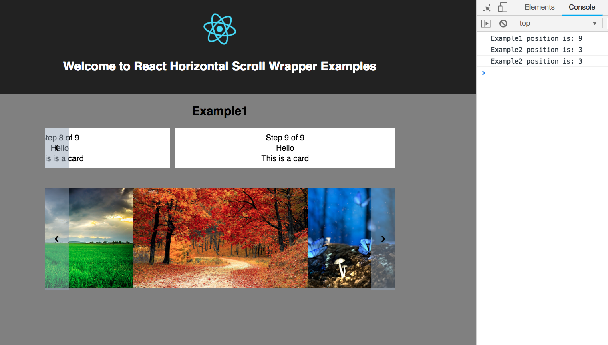

# react-horizontal-scroll-wrapper
A React Component that wrap your children in a horizontal scroll container.



## usage
Examples can be found [here](https://github.com/dylan-shao/react-horizontal-scroll-wrapper/tree/master/src/examples).
```javascript
<HorizontalScrollWrapper
  smooth
  onItemScroll={position => {
    this.updatePosition(position);
  }}
  position={currentStep}
  onUnmount={() => {
    this.updatePosition(null);
  }}
>
  {children}
</HorizontalScrollWrapper>

```
## Props
> children: node, children you want to render

> onItemScroll: func, will be called when item scroll, with the position of the children (start from 1)

> onUnmount: func, unmount hook

> position: number, could be used as inital position

> disappearPercent: number, percentage control when to hide the next and prev button when you at first or last child, 0 - 1, default 0.1

> wait: number, milliseconds that you want the onItemScroll to be called, default 200

> smooth: bool, set to true when you want the item to smoothly move **without center itself** when you scroll
